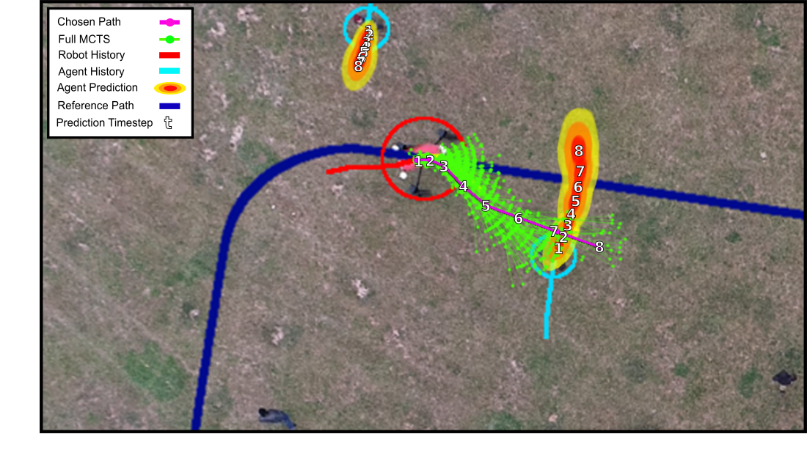
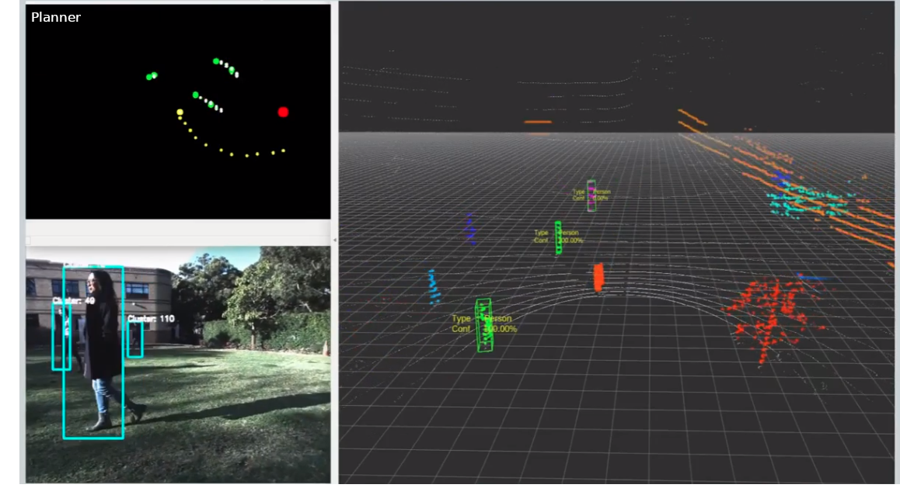
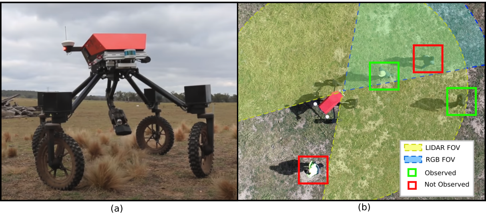
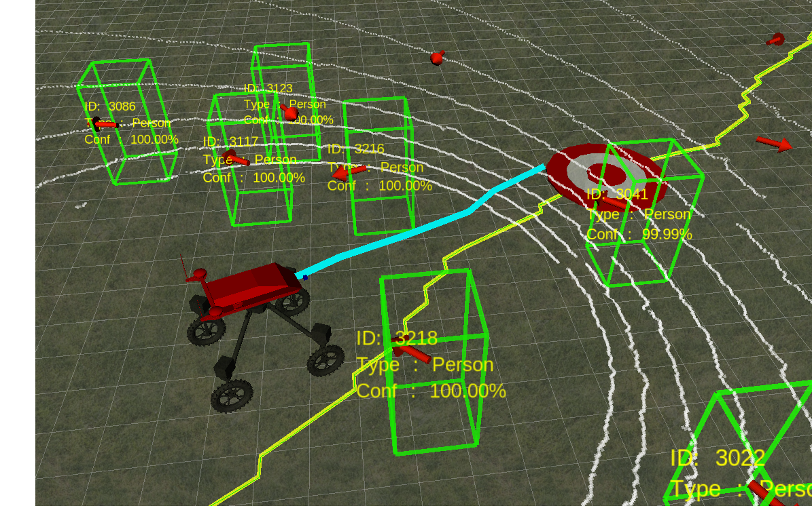
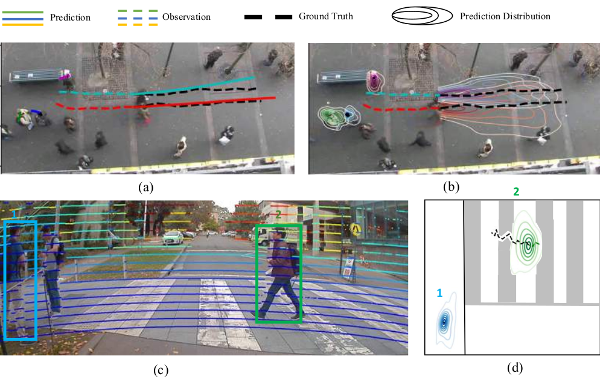
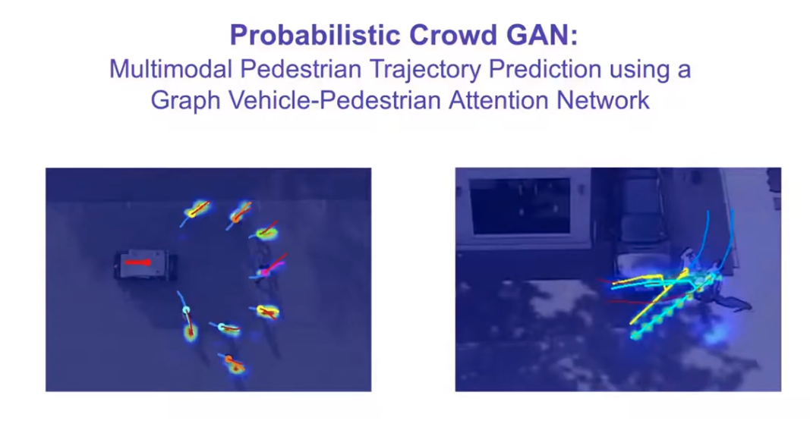
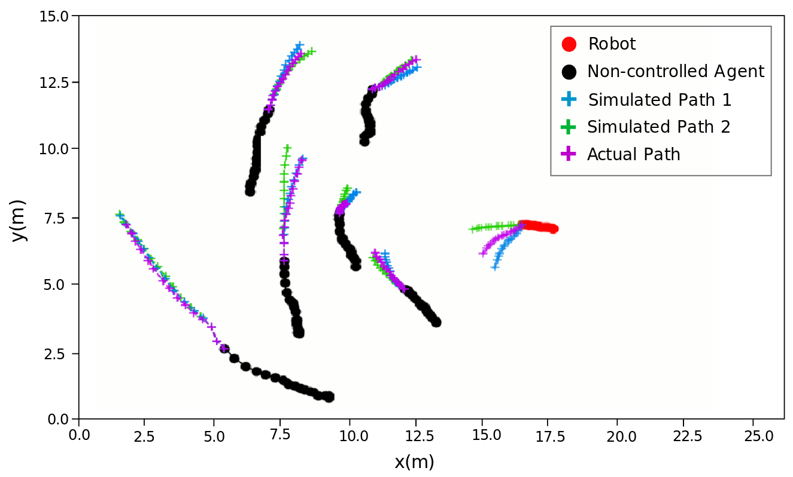

I'm a PhD student at the Australian Centre for Field Robotics, University of Sydney.
My work focuses on how mobile robots can better interact with humans in the real world, merging computer vision perception, motion prediction and dynamic path planning.

  

 
  <a href="https://scholar.google.com/citations?user=cNPgbCcAAAAJ&hl=en">Google Scholar</a> |
  <a href="https://www.sydney.edu.au/engineering/about/our-people/research-students/stuart-eiffert-705.html">Uni Page</a> |
  <a href="mailto:stuarteiffert@gmailcom">Email</a>

# My Work
## Field Robotics
 
 **Resource and Response Aware Path Planning for Long-term Autonomy of Ground Robots in Agriculture**  
*S. Eiffert, N. D. Wallace, H. Kong, N. Pirmarzdashti, and S. Sukkarieh, “Resource and Response Aware Path Planning for Long-term Autonomy of Ground Robots in Agriculture,” Accepted for publication in Field Robotics, 2021.*  
[paper](https://arxiv.org/abs/2105.10690) | [video](https://www.youtube.com/watch?v=DGVTrYwJ304)  
  
  
   

 **Path Planning in Dynamic Environments using Generative RNNs and Monte Carlo Tree Search**  
*S. Eiffert, H. Kong, N. Pirmarzdashti, and S. Sukkarieh, “Path Planning in Dynamic Environments using Generative RNNs and Monte Carlo Tree Search,” in 2020 IEEE International Conference on Robotics and Automation (ICRA), 2020a, pp. 10 263–10 269.*  
[code](https://github.com/stuarteiffert/MCTS-GRNN) | [paper](https://arxiv.org/abs/2001.11597) | [video](https://www.youtube.com/watch?v=vBPKiqtCYRU&ab_channel=StuartEiffert)

  
   
 
 **Experimental Evaluation of a Hierarchical Operating Framework for Ground Robots in Agriculture**  
*S. Eiffert, N. D. Wallace, H. Kong, N. Pirmarzdashti, and S. Sukkarieh, “Experimental Evaluation of a Hierarchical Operating Framework for Ground Robots in Agriculture,” in 17th International Symposium on Experimental Robotics (ISER), 2020*  
[paper](https://arxiv.org/abs/2105.10845)

  
   
 
 **A Hierarchical Framework for Long-term and Robust Deployment of Field Ground Robots in Large-Scale Farming**  
*S. Eiffert, N. D. Wallace, H. Kong, N. Pirmarzdashti, and S. Sukkarieh, “A Hierarchical Framework for Long-term and Robust Deployment of Field Ground Robots in Large-Scale Farming,” in 2020 IEEE 16th International Conference on Automation Science and Engineering (CASE), pp. 948–954, 2020.*  
[paper](https://arxiv.org/abs/2001.11597)

   
## Motion and Activity Prediction

  **Attentional-GCNN: Adaptive Pedestrian Trajectory Prediction towards Generic Autonomous Vehicle Use Cases**  
*K. Li, S. Eiffert, F. Gomez-Donoso, M. Shan, S. Worrall, and E. Nebot, “Attentional-GCNN: Adaptive Pedestrian Trajectory Prediction towards Generic Autonomous Vehicle Use Cases,” in 2020 IEEE International Conference on Robotics and Automation (ICRA), 2021.*  
[paper](https://arxiv.org/abs/2011.11190)

  
   
 
  **Probabilistic Crowd GAN: Multimodal Pedestrian Trajectory Prediction using a Graph Vehicle-Pedestrian Attention Network**  
*S. Eiffert, K. Li, M. Shan, S. Worrall, S. Sukkarieh, and E. Nebot, “Probabilistic Crowd GAN: Multimodal Pedestrian Trajectory Prediction using a Graph Vehicle-Pedestrian Attention Network,” IEEE Robotics and Automation Letters, vol. 5, no. 4, pp. 5026–5033, 2020.*  
[paper](https://arxiv.org/abs/2006.12906) | [video](https://www.youtube.com/watch?v=3Zlp9X4yrkY)

  
   
 
 * **Predicting Responses to a Robot's Future Motion using Generative Recurrent Neural Networks**  
S. Eiffert and S. Sukkarieh, “Predicting Responses to a Robot’s Future Motion using Generative Recurrent Neural Networks,” Proceedings - ARAA Australasian Conference on Robotics and Automation (ACRA), 2019.*  
[paper](https://arxiv.org/abs/2001.11597)

 
   
 
**Human Activity Recognition from 2D pose using RNNs**  
 Classification of human activities using a 2D skeletal pose time series dataset and an LSTM RNN. A proof of concept that using a series of 2D poses, rather than 3D poses or a raw 2D images, can produce an accurate estimation of the behaviour of a person or animal  
[code](https://github.com/stuarteiffert/RNN-for-Human-Activity-Recognition-using-2D-Pose-Input)

  

  
 
